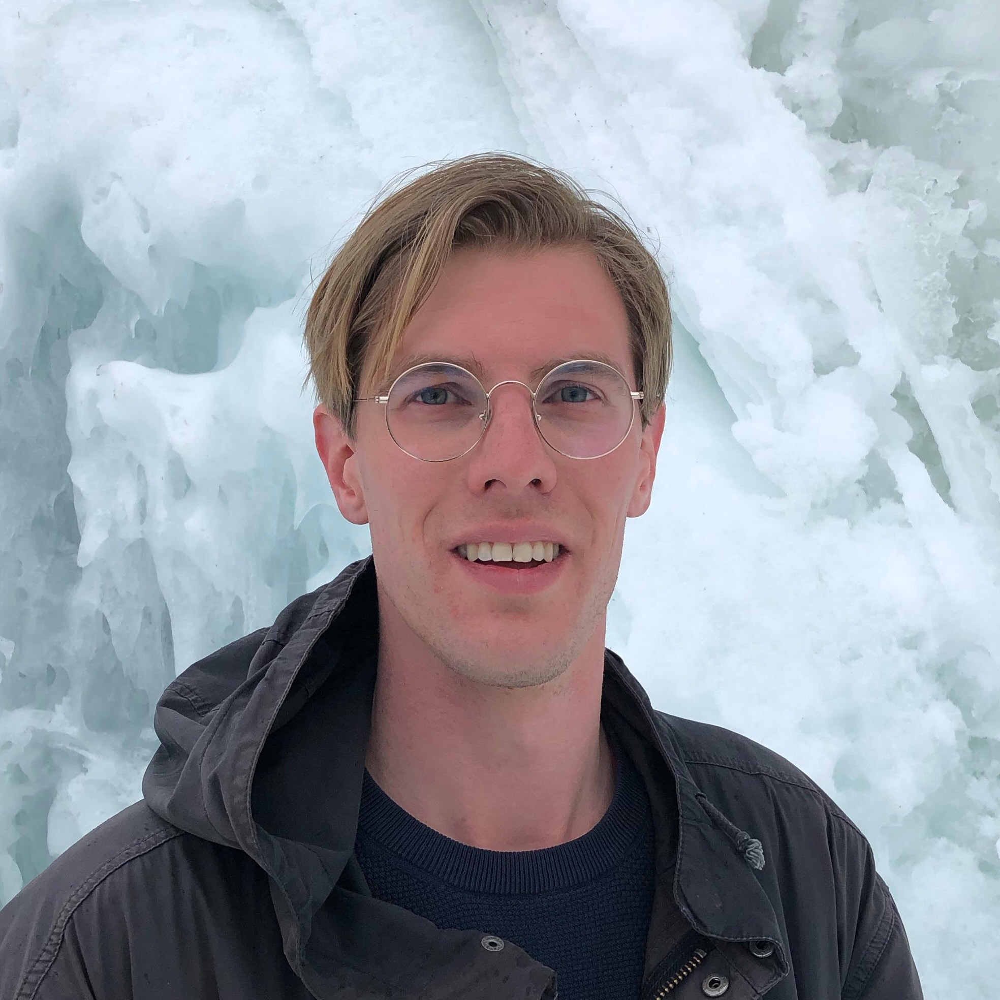

---
#
# By default, content added below the "---" mark will appear in the home page
# between the top bar and the list of recent posts.
# To change the home page layout, edit the _layouts/home.html file.
# See: https://jekyllrb.com/docs/themes/#overriding-theme-defaults
#
layout: home
title: #Welcome
---

<!--  -->

  Marcus Klasson

  Postdoc at Aalto University, Finland

<!-- 
<h1 style="padding-left:230px;">  Marcus Klasson</h1>
<h3 style="padding-left:230px;">  Postdoc at Aalto University, Finland</h3>
-->

<!-- 
I am a postdoctoral researcher at the Computer Science department of Aalto University in Finland, 
where I am supervised by Prof. [Arno Solin](https://users.aalto.fi/~asolin/) and Prof. [Juho Kannala](https://users.aalto.fi/~kannalj1/). 
My research project is on Uncertainty Quantification in Deep Vision Models and is funded by [FCAI](https://fcai.fi/). 

Before joining Aalto, I obtained my PhD at the [divison of Robotics, Perception, and Learning (RPL)](https://www.kth.se/is/rpl/) 
at KTH Royal Institute of Technology in Stockholm, Sweden, 
where I was supervised by Prof. [Hedvig Kjellström](https://www.kth.se/profile/hedvig) and Dr. [Cheng Zhang](https://cheng-zhang.org/). 
-->
 

I am a postdoctoral researcher at the Computer Science department in Aalto University, working mainly with [Arno Solin](https://users.aalto.fi/~asolin/) and [Juho Kannala](https://users.aalto.fi/~kannalj1/). 
My research project is focused on developing uncertainty-aware methods for computer vision applications and is funded by [FCAI](https://fcai.fi/). 
I am interested in 3D computer vision, deep learning, probabilistic methods for uncertainty estimation, and their real-world applications where the developed method must adapt fast under limited supervision and resources.  
<!-- 
Currently, I am working on incorporating uncertainty estimation into Neural Radiance Fields to improve the robustness in novel view synthesis, for instance, to detect unseen parts and outliers in the scene. 
My research interests are in probabilistic deep learning for uncertainty estimation in 3D computer vision tasks to build models that must adapt fast under limited supervision and computational resources. 
-->

I obtained my PhD from KTH Royal Institute of Technology in Sweden, 
where I was supervised by [Hedvig Kjellström](https://www.kth.se/profile/hedvig) and [Cheng Zhang](https://cheng-zhang.org/). 
My thesis was motivated from assisting visually impaired people using computer vision, where I focused on image classification of groceries and continual learning.
My PhD experience taught me to aim for formulating research questions based on real-world needs to recognize what challenges should be tackled to reach certain goals. 

<!-- 
#### **News**

* **2023-02-01.** I have relocated to Helsinki in Finland and started working as a postdoc at Aalto University supervised by 
Prof. [Arno Solin](https://users.aalto.fi/~asolin/) and 
Prof. [Juho Kannala](https://users.aalto.fi/~kannalj1/).  

* **2022-11-08.** I have passed my thesis defense and obtained my PhD degree! Special thanks to my opponent Prof. Davide Bacciu; my grading committee members Prof. Serge Belongie, Prof. Per-Erik Forssén, and Prof. Nataša Sladoje; my chairperson Danica Kragic and my supervisors Prof. Hedvig Kjellström and Dr. Cheng Zhang. 
[PDF Link to thesis](https://marcusklasson.github.io/files/phdthesis_MarcusKlasson.pdf), [Slides](https://marcusklasson.github.io/files/phdthesis_slides.pdf)
-->

<!--
* **2022-10-24.** I will defend my thesis on November 8. 
The defense starts at 9.00 (Swedish time) in Room F3 at KTH Campus and will also be on [Zoom](https://kth-se.zoom.us/j/61189313070).  
[PDF Link to thesis](https://marcusklasson.github.io/files/phdthesis_MarcusKlasson.pdf),
[Info about event at kth.se](https://www.kth.se/en/om/mot/kalender/fine-grained-and-continual-visual-recognition-for-assisting-visually-impaired-people-1.1199637?date=2022-11-08&orgdate=2022-11-08&length=1&orglength=1).
-->

<!--
**Summary of PhD research:**
*My PhD research has been on developing computer vision methods for assisting people with visual impairment. 
Early on, my research focused on the study of image classification for visual assistance when grocery shopping using a mobile phone. 
Here, we applied a variational autoencoder for fusing mobile phone images together with web-scraped images and text descriptions of groceries to train more accurate classifiers, compared to training with mobile phone images only. 
More recently, I have worked with replay-based continual learning motivated by mitigating catastrophic forgetting of image classifiers in user personalization scenarios. 
Our focus has been on showing the benefits of scheduling which tasks to replay at different time intervals, which is necessary in scenarios where the number of tasks exceeds the replay memory size. 
Currently, we are aiming to use reinforcement learning for learning replay scheduling policies that can generalize better than replaying all seen tasks equally.*
-->
